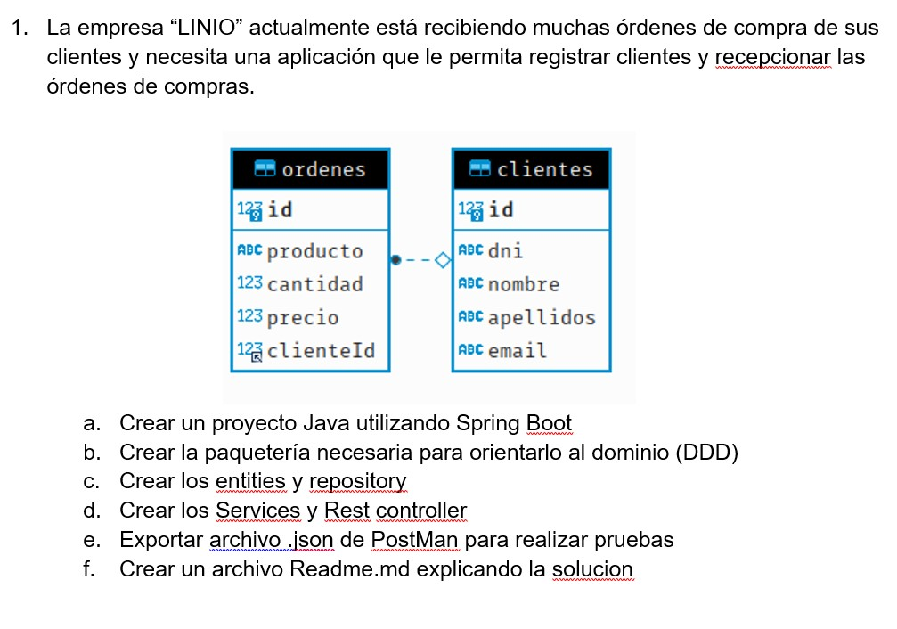

 

AUTOR

    {
        "Nombre": "Miluska Mirella Romero Torres", 
    }

raíz de base de datos H2: 
> http://localhost:8082/h2-console/

Ya existe un cliente creado mediante el loader con ID : 1

AGREGAR ORDEN o ACTUALIZAR ORDEN (ENVIAR CON ID PARA ACTUALIZAR)
> localhost:8082/api/orders/save

> MÉTODO: 
>POST

    {
            "product": "Caja de chelas",
            "quantity": 30,
            "price": 50,
            "clientId": "1"
    }

MOSTRAR ORDEN POR ID
, ENDPOINT:
>localhost:8082/api/orders/1

> MÉTODO: GET 

MOSTRAR TODAS LAS ORDENES
, ENDPOINT:
>localhost:8082/api/orders/all

> MÉTODO: GET 

ELIMINAR ORDEN POR ID, ENDPOINT: 
>localhost:8082/api/orders/1/delete

> MÉTODO: DELETE
  
  
AGREGAR CLIENTE o ACTUALIZAR CLIENTE (ENVIAR CON ID PARA ACTUALIZAR):

    {
            "firstName": "José",
            "lastName": "Ventura",
            "dni": 66666666,
            "email": "joseventura@gmail.com"
    }

MOSTRAR CLIENTE POR ID
, ENDPOINT:
>localhost:8082/api/clients/2

> MÉTODO: GET 

MOSTRAR TODOS LOS CLIENTES
, ENDPOINT:
>localhost:8082/api/clients/all

> MÉTODO: GET 

ELIMINAR CLIENTE POR ID, ENDPOINT: 
>localhost:8082/api/orders/2/delete

> MÉTODO: DELETE

MOSTRAR ORDENES POR ID DE CLIENTE
, ENDPOINT: 
>localhost:8082/api/orders/client/1

> MÉTODO: GET

